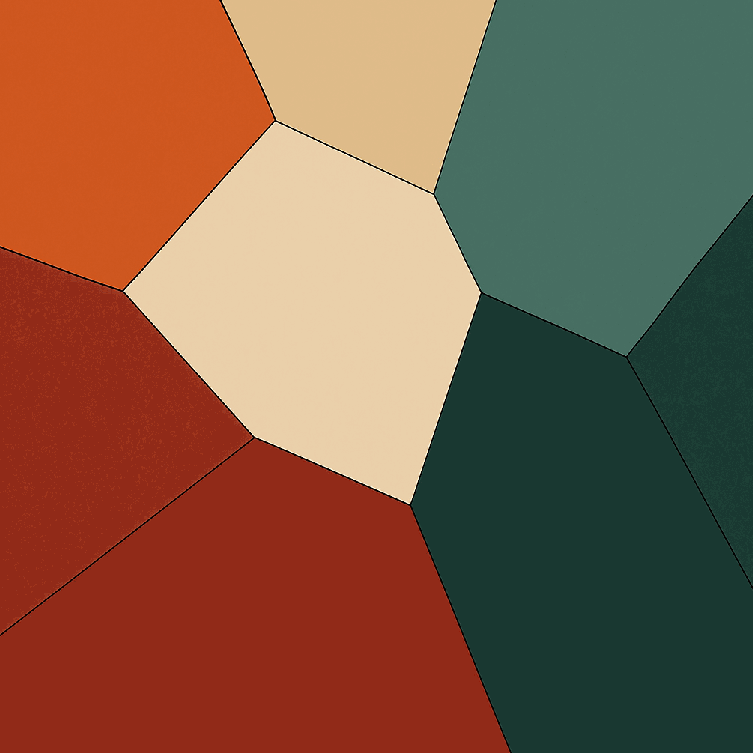

# VectorizeImage Plugin for Godot

VectorizeImage is a custom Godot plugin that turns raster textures into triangulated meshes using random distribution and edge detection without segmentation or with segmentation. Perfect for stylized assets or experimental image-based mesh generation.

> **Note:** This plugin is currently only available for local use and not yet published on the Godot Asset Library.


---

## Features

- Supports 3 generation modes: `Random`, `Edge`, and `Segment`
- Adjustable color modes: `Single` (flat color) or `Blend` (gradient)
- Built-in mesh generation using Godot’s 2D rendering
- Highly configurable dot spacing, thresholds, and resolution scaling
- Regenerate meshes live in the editor

---

## Prerequisites

- Godot Engine 4.1 and later.

---

## Installation

1. Copy the plugin folder to your project:
   ```
   res://addons/VectorizeImagePlugin/
   ```

---

## Usage

1. Add a `VectorizeImage` node to your scene.
2. Assign a texture to the **Texture Image** field.
3. Choose a **Generation Mode**:
   - `Random`: Places dots randomly
   - `Edge`: Places dots along detected edges
   - `Segment`: Places dots along color segment boundaries
4. Choose a **Color** mode:
   - `Single`: Uses center color of triangle
   - `Blend`: Averages colors between vertices
5. Adjust relevant parameters:
   - `Down Scale Multiplier`: Reduce input resolution
   - `Edge Threshold`, `Dot Spacing`, `Edge Contrast Threshold`, etc.
   - NB! Generation Mode Options are split into subcategories based on the selected mode. For example, selecting `Edge` activates parameters under 'Edge' and 'Edge and Segment', like `edge_threshold`, `color_contrast_threshold`, and `dot_spacing`.
6. Enable the **Generate** checkbox to create the mesh.


---

## Exported Parameters

These are the exported variables available in the `VectorizeImage` node and their descriptions:

| Variable                    | Type        | Description |
|----------------------------|-------------|-------------|
| `texture_image`            | `Texture2D` | Input image. |
| `down_scale_multiplier`    | `float`     | Reduces the input image resolution before processing. Higher values simplify shapes and improve performance. |
| `generation_mode`          | `int`       | Selects the algorithm for generating dots and triangulation. Options: `Random`, `Edge`, `Segment`. |
| `color`                    | `int`       | Controls how color is applied. `Single` uses one color from the center of the triangle, `Blend` averages between vertices. |
| `random_spacing`           | `int`       | Controls the approximate distance between randomly placed dots. Lower values result in more dots. |
| `edge_threshold`           | `float`     | Minimum value to consider a pixel an edge. Higher values result in narrower edges. |
| `segment_threshold`        | `float`     | Minimum value to consider a pixel an edge (used in segmentation). |
| `color_contrast_threshold` | `float`     | Minimum difference between colors to detect a transition between colors. |
| `dot_spacing`              | `int`       | Controls how frequently dots are placed in non-edge areas. Lower values increase edge dot density. |
| `Generate`                 | `bool`      | Generates and displays a triangulated mesh from the dot pattern based on the selected algorithm and parameters. |

---

## Recommended Variables

How variables affect processing time:

1. Increasing `down_scale_multiplier` reduces processing time.
2. Increasing `random_spacing` reduces processing time.
3. Increasing `edge_threshold` reduces processing time.
4. Increasing `segment_threshold` significantly reduces processing time.
5. Decreasing `color_contrast_threshold` reduces processing time.
6. Increasing `dot_spacing` reduces processing time.

> **Note:**  
> These recommendations describe how changing the variables can increase or decrease processing time.  
> **It does not mean that higher or lower values cannot be chosen** — it only affects the performance characteristics.

Recommendations based on generation mode:

- **Random Generation Mode**:  
  With `random_spacing` set to `2`, it is recommended to keep the texture size under **500×500** using the `down_scale_multiplier`.

- **Edge Generation Mode**:  
  With `edge_threshold` set to `0.5`, `color_contrast_threshold` set to `1`, and `dot_spacing` set to `10`, it is recommended to keep the texture size under **250×250** using the `down_scale_multiplier`.

- **Segment Generation Mode**:  
  With `segment_threshold` set to `0.5`, `color_contrast_threshold` set to `1`, and `dot_spacing` set to `10`, it is recommended to keep the texture size under **120×120** using the `down_scale_multiplier`.
  
---

## Feedback

Feel free to submit suggestions, issues, or feature requests via [GitHub Issues](https://github.com/unn47ur411Y/issues).

